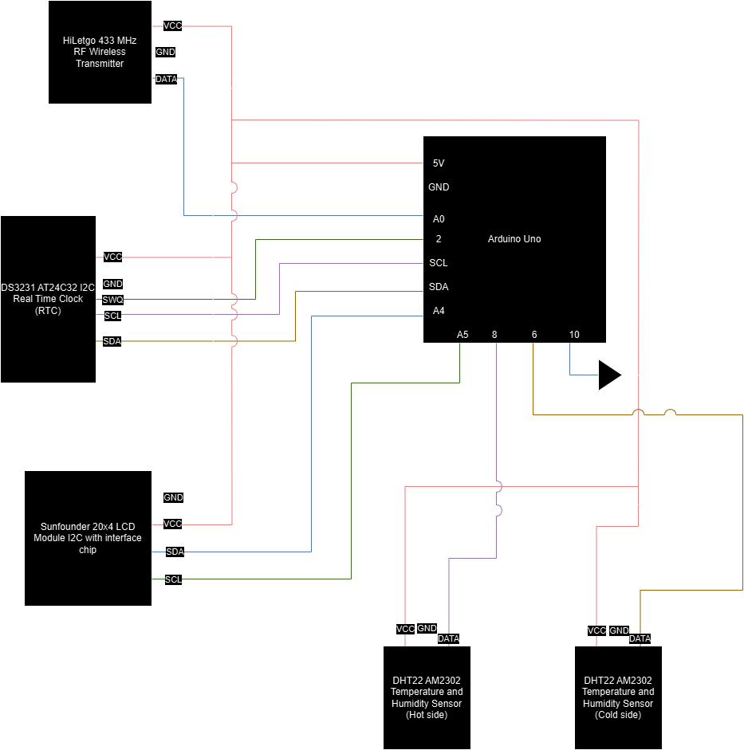
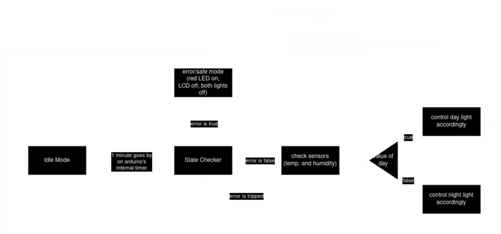

# Automated_snake_monitor
I have a snake (named Seth). This is an embedded systems project to create an automated system that monitors his cage's temperature and humidity, and controls heat lamps and misters to adjust. 

## Basic Project Info
This is meant to be mostly an embedded system's software project, rather than a hardware one. The hardware was all chosen to be the simplest possible to impliment. As such, the project used an Arduino Uno as the main brain of the controller. Most the choices for the project were made to ensure safety for either myself or Seth. 

The basic architecture for the system is a set of 433MHz wireless controlled outlet switches. Using the 433MHz RF module, the arduino can switch those outlets on or off. The temperature control loop (executed once every several minutes) checks the temperature at two separate locations of the cage (one on the hot side, one of the cold side), and will change the state of the outlets, to switch the lights on and off, depending on if the temperature needs to change. The arduino will also output all data being taken to both a serial monitor, and an LCD screen placed in front of the cage. The system also features an internal timer, automatically switching Seth's lamps between the 'day' light and 'night' light depending on the state of the timer. In this way, the system acts as a safety shutoff for when the cage gets too hot, an automatic light switch for the day and night lamps, and temperature and humidity sensor via the LCD display. 

## Hardware Used (with links to where I got them)
- [Arduino Uno](https://www.amazon.com/dp/B008GRTSV6?ref=ppx_yo2ov_dt_b_product_details&th=1)
- [HiLetgo 433MHz RF Wireless Transmitter and Receiver Module for Arduino](https://www.amazon.com/dp/B01DKC2EY4?psc=1&ref=ppx_yo2ov_dt_b_product_details)
- Etekcity Zap Remote Outlet Switch Model ZAP 5LX-S (This one I could not find at any stores. They may not make it any more. But I was able to find a set on ebay.)
- [DS3231 AT24C32 IIC Real Time Clock](https://www.amazon.com/dp/B07Q7NZTQS?psc=1&ref=ppx_yo2ov_dt_b_product_details)
- [Sunfounder 20x4 LCD Module I2C with interface chip](https://www.amazon.com/dp/B0CLGVYPYW?psc=1&ref=ppx_yo2ov_dt_b_product_details)
- [Wall outlet power supply](https://www.amazon.com/dp/B018OLREG4?psc=1&ref=ppx_yo2ov_dt_b_product_details)
- [Temperature and humidity sensors](https://www.amazon.com/gp/product/B0CPHQC9SF/ref=ppx_yo_dt_b_asin_title_o00_s00?ie=UTF8&psc=1)

## Wiring

## Software Documentation

### Etekcity Zap remote codes
| Outlet | On | Off |
| ---------- | ------------- | ------------- |
| 1 | 5248307 | 5248316 |
| 2 | 5248451 | 5248460 |
| 3 | 5248771 | 5248780 |
| 4 | 5250307 | 5250316 |
| 5 | 5256451 | 5256460 |

All codes featured a pulse length of between 185 and 188. Typically a message was picked up several times, each with slightly different pulse lengths. 